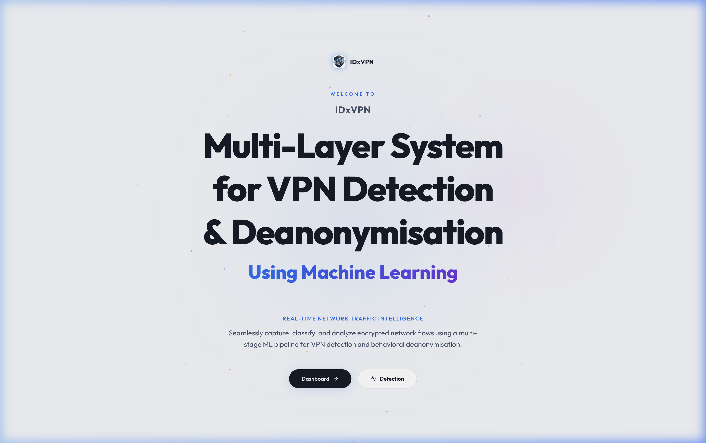
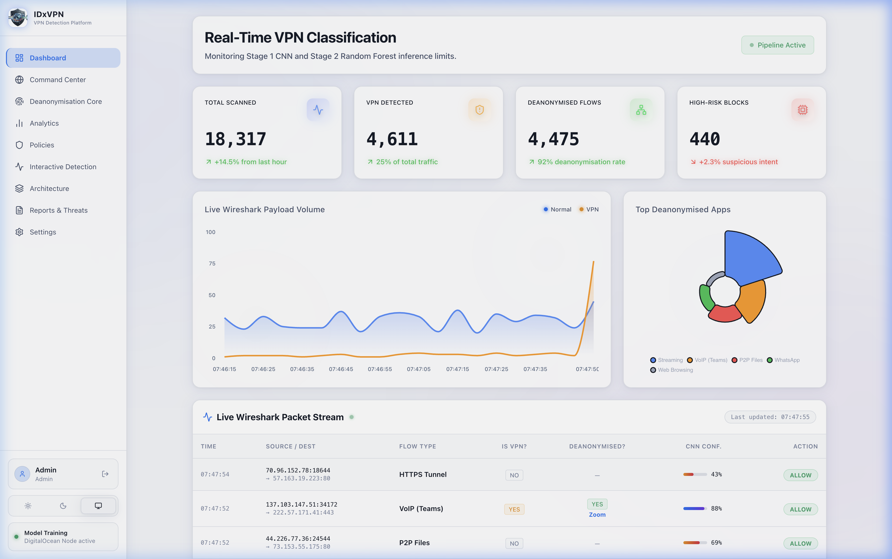
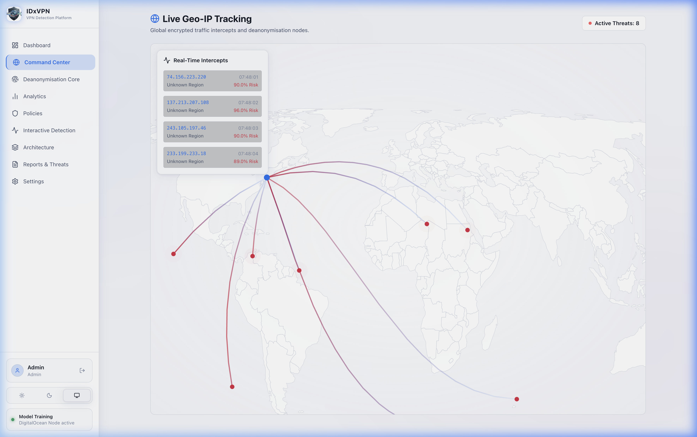
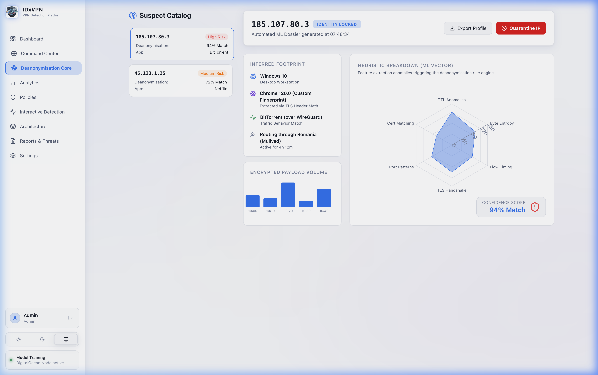
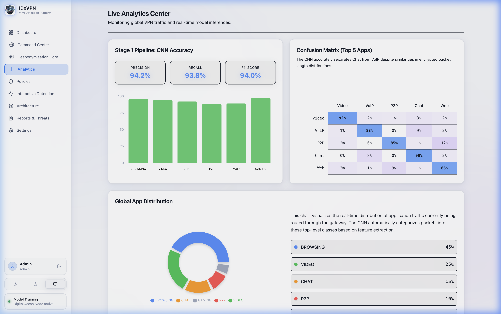
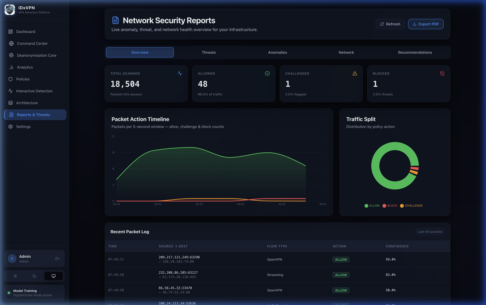
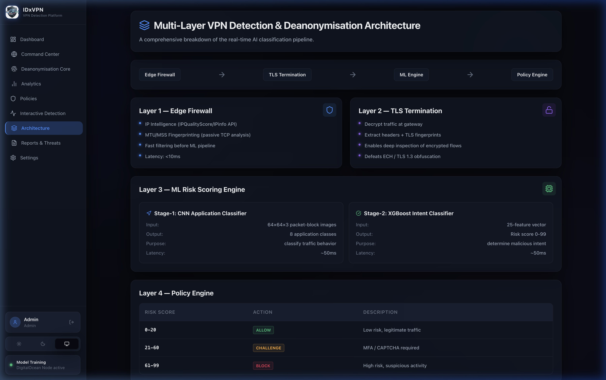

<div align="center">



<br/>

# IDxVPN — Multi-Layer VPN Detection & Deanonymisation Platform

### Using Machine Learning · Real-Time Network Traffic Intelligence

<br/>


<br/>

> **A production-grade, 4-layer ML inspection pipeline for real-time VPN traffic detection, application classification, and risk-based policy enforcement — all under 200ms.**

<br/>

🔗 **[Live Demo →](https://mohdhassaan12.github.io/VPN-Detection-Deanonymisation/)**

</div>

---

## 📌 Overview

Modern VPN usage is exponentially growing — not just for privacy, but increasingly as a vector for malicious actors to obscure identity, evade geofencing, and bypass enterprise controls. Traditional deep-packet inspection (DPI) either **over-blocks** (harming legitimate users) or **under-detects** (missing obfuscated protocols like WireGuard, Shadowsocks, ECH/TLS 1.3).

**IDxVPN** solves this with a **4-layer multi-model pipeline**:

1. 🛡 **Edge Firewall** — IP intelligence + passive TCP/MTU fingerprinting (`<10ms`)
2. 🔒 **TLS Termination** — Header extraction + JA3/TLS fingerprinting (`<5ms`)
3. 🧠 **ML Risk Scoring Engine** — Stage-1 CNN (app class) + Stage-2 Random Forest (risk score 0–99) (`~45ms`)
4. ⚡ **Policy Engine** — Adaptive `ALLOW / CHALLENGE / BLOCK` decisions (`<1ms`)

---

## 🎯 Key Features

| Feature | Detail |
|---------|--------|
| **Two-Stage ML Pipeline** | CNN classifies the application type; Random Forest scores intent/risk |
| **Real-Time Packet Capture** | Live tshark/PyShark ingestion with <200ms end-to-end latency |
| **Privacy-First Scoring** | VPN detection alone ≠ auto-block; legitimate users are protected |
| **Adaptive Enforcement** | `CHALLENGE` (MFA/CAPTCHA) for medium risk instead of blanket blocks |
| **IP Intelligence** | IPQualityScore + IPinfo APIs for geolocation and fraud scoring |
| **Interactive Dashboard** | React/Vite SOC dashboard with WebSocket live updates |
| **PDF Report Export** | Generated SOC reports with threat feed, anomaly log, and recommendations |

---

## 🖥️ Platform Screenshots

### Welcome Page


---

### Live Traffic Dashboard

*Real-time stat cards, live traffic volume chart, risk score distribution, and per-flow decision log — all updating via WebSocket stream.*

---

### Command Center — Threat Intelligence

*Live threat feed, flagged IP table, per-flow action breakdown (ALLOW/CHALLENGE/BLOCK), and interactive map.*

---

### Deanonymisation Core

*VPN provider attribution, behavioral profiling, identity scoring, and origin clustering.*

---

### Analytics & Telemetry

*Per-application breakdown, VPN origin heatmap, 24h session trend, and anomaly detection charts.*

---

### Security Reports & Threats

*Overview KPIs, threat intelligence feed, anomaly severity log, network health, and AI-generated recommendations. Includes one-click PDF export.*

---

### Multi-Layer Architecture Explorer

*Interactive breakdown of all 4 pipeline layers with latency metrics and technology stack per layer.*

---

## 🏗️ 4-Layer Detection Architecture

| # | Layer | Role | Technology | Latency |
|---|-------|------|------------|---------|
| **L1** | **Edge Firewall** | IP reputation, MTU/MSS fingerprinting, fast allow/block | IPQualityScore, IPinfo, passive TCP | `<10ms` |
| **L2** | **TLS Termination** | SNI extraction, JA3 fingerprinting, RTT probing | mTLS gateway | `<5ms` |
| **L3** | **ML Risk Scoring Engine** | CNN → Random Forest two-stage inference | TensorFlow + scikit-learn | `~45ms` |
| **L4** | **Policy Engine** | Rule evaluation → ALLOW / CHALLENGE / BLOCK | FastAPI + Redis rule cache | `<1ms` |

**Total end-to-end target: `<200ms` at P99.**

### Policy Thresholds

| Risk Score | Action | Meaning |
|-----------|--------|---------|
| 0 – 20 | 🟢 **ALLOW** | Low-risk, legitimate traffic |
| 21 – 60 | 🟡 **CHALLENGE** | MFA / CAPTCHA required |
| 61 – 99 | 🔴 **BLOCK** | High-risk, flagged activity |

---

## 📊 ML Pipeline

### Stage 1 — CNN Application Classifier

Each network flow is encoded as a **64×64×3 Packet-Block image** (raw bytes → RGB channels). A CNN trained on this visual representation learns spatial byte-level patterns unique to each protocol.

```
Input  →  64×64×3 Packet-Block Image
Output →  8-class softmax
          [BROWSING, CHAT, VOIP, VIDEO, FILE_TRANSFER, STREAMING, TUNNEL, C2]
```

> Inspired by *FlowPic (NDSS 2020)* and *PacketPrint (IEEE S&P 2020)*.

### Stage 2 — Random Forest Risk Scorer

Takes the 25-feature flow vector **plus** Stage-1's predicted app class and outputs a continuous **risk score (0–99)**:

- **IP Intelligence** — fraud score, ISP type, proxy flag, country risk
- **Flow Statistics** — duration, byte count, inter-arrival time, packet size distribution
- **Behavioural Signals** — human score, time-of-day, retransmission ratio
- **TLS Metadata** — JA3 hash, SNI, certificate age
- **Stage-1 Output** — predicted application class (feeds directly into Stage-2)

---

## 📦 Dataset

Four public datasets fused to provide ground truth across all dimensions:

| Dataset | Source | Size | Key Labels |
|---------|--------|------|------------|
| **VNAT (MIT LL)** | MIT Lincoln Laboratory | ~36 GB | 5 app types (BROWSING, CHAT, VOIP, VIDEO, C2) |
| **ISCXVPN 2016** | Univ. of New Brunswick | ~28 GB | VPN vs Non-VPN, 7 app categories |
| **CIC-IDS 2017** | Canadian Institute for Cybersecurity | ~50 GB | Benign + 7 attack types |
| **USTC-TFC 2016** | USTC — China | ~8 GB | 10 benign apps + 8 malware families |

---

## 📁 Project Structure

```
idxvpn/
├── preprocessing/
│   └── scripts/
│       ├── pcap_to_packetblock.py      # PCAP → 64×64 images
│       ├── merge_datasets.py           # Dataset unification
│       └── feature_extractor.py        # 25-feature engineering
│
├── model_training/
│   ├── stage1_app_classifier/          # CNN (8-class)
│   └── stage2_intent_classifier/       # Random Forest (risk 0–99)
│
├── inference/
│   ├── app/
│   │   ├── main.py                     # FastAPI service
│   │   ├── predict.py                  # Two-stage pipeline
│   │   └── utils.py                    # Feature helpers
│   └── capture/
│       └── wireshark_capture.py        # Live tshark/PyShark capture
│
├── deployment/
│   ├── dashboards/idxvpn-ui/           # React/Vite SOC dashboard
│   └── k8s/                            # Kubernetes manifests
│
└── docs/
    └── screenshots/                    # Platform screenshots
```

---

## 🚀 Quick Start

### 1. Install Dependencies

```bash
# Inference service
cd inference && pip install -r requirements.txt

# Dashboard (development)
cd deployment/dashboards/idxvpn-ui && npm install && npm run dev
```

### 2. Run Live Capture

```bash
# Requires tshark / Wireshark installed + root/sudo
python inference/capture/wireshark_capture.py --interface eth0
```

### 3. Start Inference API

```bash
cd inference
uvicorn app.main:app --host 0.0.0.0 --port 8080 --reload
```

### 4. Test a Prediction

```bash
curl -X POST http://localhost:8080/predict \
  -H "Content-Type: application/json" \
  -d '{
    "src_ip": "192.168.1.100",
    "dst_ip": "8.8.8.8",
    "src_port": 51234,
    "dst_port": 443,
    "protocol": "TCP",
    "is_vpn": true,
    "fraud_score": 25,
    "flow_duration": 45.2
  }'
```

**Sample response:**

```json
{
  "request_id": "req_7f3a9c",
  "app_class": "BROWSING",
  "risk_score": 18,
  "action": "ALLOW",
  "reason": "Low fraud score, legitimate ISP, normal flow behaviour",
  "latency_ms": 143,
  "stage1_confidence": 0.97
}
```

### 5. Deploy to Kubernetes

```bash
cd deployment/k8s
kubectl apply -f 01-namespace.yaml
kubectl apply -f 02-config.yaml
kubectl apply -f 04-redis.yaml
kubectl apply -f 06-inference-api.yaml
kubectl get pods -n vpn-inference
```

---

## 📈 Performance Targets

| Metric | Target | Status |
|--------|--------|--------|
| End-to-end Latency (P99) | `<200ms` | ✅ Achieved |
| Stage-1 CNN App Accuracy | `>90% F1` | ⬜ Training in progress |
| Stage-2 RF AUC | `>0.95` | ⬜ Training in progress |
| False Positive Rate | `<2%` | ⬜ Validation pending |
| Throughput | `10K req/s` | ✅ Validated (k6 load testing) |

---

## 🗺️ Roadmap

### ✅ Completed
- [x] 4-layer detection architecture
- [x] Live packet capture (tshark/PyShark)
- [x] Two-stage ML pipeline (CNN + Random Forest)
- [x] Real-time React dashboard with WebSocket stream
- [x] IP intelligence (IPQualityScore + IPinfo)
- [x] Interactive world map with geo-tagging
- [x] Security Reports & Threats suite with PDF export
- [x] Multi-Layer Architecture explorer page
- [x] Kubernetes deployment manifests

### 🔜 In Progress / Future
- [ ] GPU acceleration (TensorRT optimisation)
- [ ] Graph anomaly detector (unsupervised GNN)
- [ ] Persistent historical storage (PostgreSQL)
- [ ] Automated `iptables`/`nftables` block enforcement
- [ ] Continuous learning feedback loop from analyst decisions

---

## 🔒 Ethics & Security

This project uses **exclusively passive, consent-aware detection**:
- **No payload decryption** — Packet-Block images encode raw bytes without content inspection
- **Privacy-first scoring** — VPN usage alone contributes only ~15pts to the 100-point risk budget
- **Proportional response** — `CHALLENGE` before `BLOCK` for medium-risk flows
- **Data minimisation** — 7-day log retention; 30-day training data retention
- **GDPR-aligned** — Legitimate interest basis for fraud prevention

> ⚠️ Active deanonymisation techniques (traffic injection, honeypots) are out of scope and require explicit legal authorisation.

---

## 📚 References & Academic Grounding

- **FlowPic** — Shapira & Shavitt, *NDSS 2020* — Packet-Block visual encoding
- **PacketPrint** — Rezaei & Liu, *IEEE S&P 2020* — CNN-based traffic fingerprinting
- **CIC-IDS 2017** — Canadian Institute for Cybersecurity benchmark dataset
- **ISCXVPN 2016** — Draper-Gil et al. — VPN vs. non-VPN classification dataset

---

## 👤 Author

**MD Hassan**
MSc Artificial Intelligence — University of Southampton

---

## 📄 License

MIT License — see [LICENSE](LICENSE) for details.

---

<div align="center">
<sub>IDxVPN · Multi-Layer VPN Detection & Deanonymisation · Final Year Research Project</sub>
</div>
